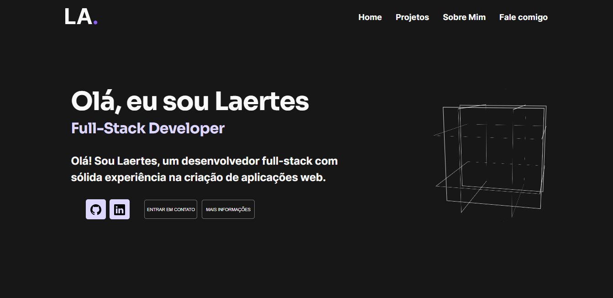

<h1 align="center">Portifóliio de Laertes</h1>

<h2 align="center"> Quem sou ? :wave: </h2> 

Olá 👋 , me chamo Laertes, sou um desenvolvedor full-stack aficionado pelo desenvolvimento web, comecei os estudos na área da programação há aproximadamente dois anos e cada vez mais me apaixono pelo que faço. Sou desenvolvedor full-stack com habilidades em diversar tecnologias.

<h2 align="center">  :computer: Sobre o projeto :computer: </h2>

Esse é o meu portfólio, criado com a intenção de falar um pouco sobre mim e mostrar o meu conhecimento com a programação. Nele está presente: A parte inicial (home), a parte de projetos, sobre mim, e o Fale comigo. O site é totalmente responsivo e foi criado pensando nos mínimos detalhes.

<h2 align="center">  :computer: Tecnologias utilizadas :computer: </h2>

  
  
  
  
  

  <h4> :exclamation: Também foi utilizado a api de envio de email : <a href="https://www.emailjs.com/" target="_blank"> EmailJs</a> :exclamation: </h4>

<h2 align="center"> :exclamation: Guia :exclamation: </h2>

<h2 align="center">O site é composto por apenas duas páginas </h2>

<h3 align="center" id="home-id"> HOME </h3>

 Nela está presente:  a parte de projetos (onde está a amostra os meus projetos); a parte de Sobre Mim (onde há um breve resumo sobre mim); a parte de Fale comigo( onde é possivel mandar um email para mim).

<h3 align="center">Sobre Mim</h3>

Ela pode ser acessada pelo botão "VEJA MAIS" que está presente na parte de sobre mim da página  <a href="home-id"> HOME </a>  

